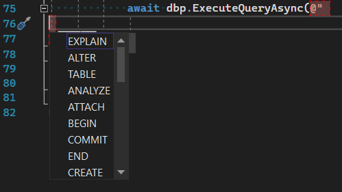

# ReSequel

Let's say we're working on a project that uses an RDBMS but doesn't use an ORM. You are using plain SQL, the queries of which are written in the source code. This is not a uniquely bad approach, it has pros and cons. The upside is that you eliminate a whole software layer (ORM) that can be buggy and consumes CPU cycles and RAM bytes. In addition, I am convinced that plain SQL is easier to read and understand than the Aesopian language of various ORMs. The main disadvantage of this approach is that when changing the database schema, it is difficult to find all the queries that need to be changed in the codebase. Errors of this kind usually show up at runtime. ReSequel aims to fix this problem.

ReSequel is a tool for validate SQL queries in your code against your database schema. ReSequel can work as a console program, and as a Visual Studio 2019/2022 extension (VSIX).

In any mode ReSequel DOES NOT run your program, and DOES NOT run your SQL queries to actual execution, but ReSequel uses RDBMS engine to do various tasks like syntax validation, etc. ReSequel is powered by Roslyn and uses it to extract SQL queries from your code. Places which contains SQL qieries are defined in a ReSequel XML setup file that can be differenet for different `sln`/`slnf`.

ReSequel supports Microsoft SQL Server 2012 (and later), SQLite 3 and Postgres (beta).

# Modes

## Command line mode

For run ReSequel in command line mode please build `ReSequel.csproj`. You will receive `ReSequel.exe` that require 5 command line arguments:

- 1st argument: path to you `sln`/`slnf` file
- 2nd argument: path to `ReSequelSetup.xml` file
- 3rd argument: a RDBMS type (`SqlServer`, `Sqlite`, `Postgres`)
- 4th argument: connection parameters.
- 5th argument: a connection string to your database.

After that, ReSequel will build your `sln`/`slnf`, gets its compilation symbols (via Roslyn), scans that symbols for SQL queries (using `ReSequelSetup.xml`), validate found queries against your DB schema, and print analysis result into console.

As a structured artifact ReSequel stores its results into the file `report.json` that can be picked up for analyzis.

Examples for command lines:

```
SqlServer
C:\projects\github\ReSequel\DbProviderExample\DbProviderExample.sln C:\projects\github\ReSequel\DbProviderExample\ReSequelSetup.xml SqlServer "Data Source=.; Initial Catalog=master; Integrated Security=true; Connection Timeout=30;" "" True

SystemDataSqlite
C:\projects\github\ReSequel\DbProviderExample\DbProviderExample.sln C:\projects\github\ReSequel\DbProviderExample\ReSequelSetup.xml SystemDataSqlite "Data Source=system.data.encoded.db;Version=3;" "Password=mypassword;CaseSensitive=False" True

MicrosoftDataSqlite
C:\projects\github\ReSequel\DbProviderExample\DbProviderExample.sln C:\projects\github\ReSequel\DbProviderExample\ReSequelSetup.xml MicrosoftDataSqlite "Data Source=encoded_with_cipher.db;" "Password=mypassword;CaseSensitive=False" True

Postgresql
C:\projects\github\ReSequel\DbProviderExample\DbProviderExample.sln C:\projects\github\ReSequel\DbProviderExample\ReSequelSetup.xml Postgresql "Server=localhost; Database=ReSequel; Port=5432; SSLMode=Prefer" "" True
```

This mode is useful in automation scenarios.

## Visual Studio extension (Vsix) mode

For a programmer a Vsix mode has been developed. You need to build `Extension.2019` or `Extension.2022` project and install vsix file into your instance of Visual Studio. As an alternative, a compiled distro can be downloaded here for a Visual Studio 2019 and here for a Visual Studio 2022.

After installing ReSequel extension into your Visual Studio, you find the following menu:


- `ReSequel Solution Status` allows you to control ReSequel status for current solution. ReSequel stores its `xml` files in context of solution, so you need to open solution to make ReSequel fully functional.
- `Edit Settings` allows you to edit `ReSequelSetup.xml`.
- `Choose default SQL executor` allows to change a target database (different SqlServer/Postgres instances/databases, or even SqlServer/Sqlite/Postgres databases)
- `Solution-wide SQL scanner` is able to scan your solution in the same way as console mode doing that; but results will be put in tool window inside Visual Studio. Additional details can be found below.
- `Reset SQL colorization` resets SQL colorization colors to its defaults.
- `Open ReSequel Options` opens a ReSequel options page. It can be doing manually in menu Tools/Options/ReSequel.
- `Show ReSequel release notes` opens a ReSequel release notes `md` file. It is recommended to install a Markdown editor Visual Studio Extension into your Visual Studio instance. Also, a Release Notes Notification goldbar will show at the start of Visual Studio, if ReSequel found that a new version of itself has been installed.

This mode is useful in everyday developping activities.

### How to start

For demonstation purposes we will work with `DbProviderExample.sln` from ReSequel repository and a SQL Server instance.

- At first, you need to open solution you will work with. Open `DbProviderExample.sln` from ReSequel repository.
- Invoke `ReSequel Solution Status` command and create a `ReSequel Configuration Generic File` and `ReSequel Setup Generic File` if they does not exists (for a `DbProviderExample.sln` these files exists, so this step may be skipped).
- Invoke `Edit Settings` command and edit command line for SQL Server executor; save this file.
- Open any `cs` file which contains SQL queries, for example `Unsorted.cs`; wait for a few seconds, you will see something like this:


The things you see are

### Visual Adornments

Green ones means SQL query has been validated successfully. Red - validation fails because of errors in SQL queries or because the queries cannot be parsed at compile time. Gray - queries are muted (probably, queries cannot be validated for some reason and were muted by a programmer). All of these colors can be customized in ReSequel options.

As you started to write your code, all ReSequel adornments disappears to make your typing as fast as Visual Studio can. A few seconds later after you stopped to modify the text, ReSequel starts scanning again and validation results and colorization gets back.

### Visual Studio ReSequel options

Behaviour of ReSequel can be modified in various aspects.

Here are the options for SQL queries background colors and opacity, border colors, completion status and a switch for a strict mode:


- `Timeout for adornments` is a timeout in seconds you need to wait unitl adornments shows up after you stopped typing.
- `Use graphem for drop-down buttons` replaces text via the short Unicode graphems to save your screen space.
- `Completion Status` enables a completion list during typing a C# literals.
- `Strict mode` switches ReSequel into the strict mode. Additional details about strict mode can be found below.
- Color options setup a adornments colors.


Here are the options for foreground SQL colorization, switch to on/off it and ability to use TSQL colorizer for any SQL dialect:


- `Enabled` enables a colorization of SQL **tokens** (yes, inside your C# string literals). Switching foreground colorization off makes VS UI smoother.
- `Use TSQL Colorizer` means that ReSequel will use TSQL token colorizer for a non-SQL databases (sqlite, postgres). It may not be 100% correct, but in the other case colorization for sqlite/postgres will be disabled (due to absense of such SQL parsers in public domain).
- Visuals contains a various colors for a various parts of SQL queries.


### Solution-wide scanner

ReSequel Visual Studio Extension is able to scan your solution for a SQL queries and show the results. You are able to filter these results by a various parameters.

Please take a look how solution-wide scanner tool window looks:


For a sqlite\postgres some controls will be unavailable due to absense of such SQL parsers in public domain.

TODO: what window's controls means

### Solution filters

If you had performed Solution-wide scanning, you are able to use solution filters now to easily find C# files with failed (RED) or muted SQL queries. These filters adopts information from solution-wide scanner, so you need to run it first.


### Context menu


- `Ctrl+C Default` copies current SQL into clipboard. If SQL database supports parsing queries, the required parameters will be added to the script.
- `Ctrl+C Current` does the same, but for current selected SQL query in case of generator. Generators are explained below.
- `Mute everywhere` muted the query in every solution by added a special ReSequel-comment at the line above.
- `Mute here` muted the query only for this solution. It may be useful in the case a `cs` file is included in a few csprojes/solutions.
- `Build map class` builds an anonymous C# class that contains a properties to map a SQL result set into. This class is indended to use with `linq2db`.
- `Build param class` build an anonymous C# class that contains a parameters for the SQL query. This class is indended to use with `linq2db`.
- `Format query` opens an formatting window:


it's an experimental feature, so its button is yellow.

Some RDBMS may have subset of the buttons disabled because of absense of public SQL parser or other technical reasons.

### Auto completion

ReSequel support auto completion for SQL keywords and a table\view names:




Completion is in initial state of developing, so may work unstable.

# Strict

Strict mode is a mode in which it is not allowed to omit `into` in an `insert` query, `from` in a `delete` query, and it is also required to explicitly specify columns in an `insert` query. Every such query will be recognized as FAILED.

This mode can be enabled in setup xml file.

# Generators

Imagine that you are creating a bus ticket sales system. The system is half ready and now the customer asks you to create a report that will show the amount of sales for a certain period. Accordingly, you write something like this: 

```SQL
select sum(cost) from tickets where sell_date >= @date1 and sell_date < @date2
```

Of course, in a real system, the report will be much more complex and meaningful. Now the customer is satisfied, but, as we all know, he is not satisfied for long. A couple of hours later, he comes to you again and asks you to make the SAME report, but not by the date the ticket was sold, but by the date of the trip. The request for it might look something like this: 

```SQL
select sum(cost) from tickets where trip_date >= @date1 and trip_date < @date2
```

Here, the engineer has a choice: either create a new SQL query, or create logic that modifies an existing query, depending on which report the user requested. Both options have their pros and cons. Sometimes it's reasonable to allow almost the same queries in the codebase, sometimes it's preferable to modify the "skeleton" of the query for a specific report. Suppose, in our case, the engineer decided to take the second path. So he created a "skeleton" of the query: 

```SQL
select sum(cost) from tickets where {0} >= @date1 and {0} < @date2
```

and using `string.Format` substitutes either `sell_date` or `trip_date`. There is a problem here: ReSequel does not execute the application code, but only works with compilation symbols. Therefore, such requests will not be visible to it and errors may appear in them when the structure of the DB changes. 

"Generators" is a shorthand name for a mechanism that achieves both goals: to prevent clone queries in the codebase and to validate such non-constant queries. 

To do this, we need to divide the problem into 2 parts: in the first part of the problem, we define the "skeleton" of the query and all possible "options" for it. All of these lines must be compile-time constants. In the second part of the problem, we need a mechanism that substitutes the specific, currently selected options at runtime. 

ReSequel is completely oblivious to the second part, he knows nothing about it. ReSequel takes the "skeleton" query and iterates through all the options, substituting all available options into the "skeleton" and validating each option. If at least 1 option fails, the entire request is considered to be failed. 

Let's move on to the code. Let's look at this example: 

```C#
        private string GetReportSql(bool useSellDateInsteadOfTripDate)
        {
            var generator = new ....;

            var sql = generator
                .WithQuery(@"
select sum(cost) from tickets where {0} >= @date1 and {0} < @date2
")
                .DeclareOption("dateOption", "sell_date", "trip_date") //put into {0}
                .MakeGenerator()
                .BindToOption("dateOption", useSellDateInsteadOfTripDate)
                .GenerateSql();

            return sql;
        }
```

Everything before `BindToOption` is the first part of the problem, these are the expressions ReSequel looks at. Let's see how this code works. 

The `DeclareOption` method contains the name of the option (`dateOption`), followed by a list(!) of valid values for the option. `BindToOption` contains the name of the option and a specific value indicating which of the `DeclareOption` values to select. 

When the program is running, the generator takes into account which value from each option need to be substituted here-and-now, based on the expression `BindToOption("dateOption", useSellDateInsteadOfTripDate)` and the value of the variable `useSellDateInsteadOfTripDate`. Thus, depending on the value of `useSellDateInsteadOfTripDate`, the method returns one of the two requests required by the customer. 

How ReSequel works: ReSequel finds the generator expression in your codebase, extracts the "skeleton" string from the compilation symbols (this must be a compile-time constant), extracts all(!) options from `DeclareOption` expressions, generates all possible queries, and validates them against your database schema.

The working code of the generator is in the test project. I recommend studying it.

Let's look at a more complex example: 

```C#
        private string GetReportSql(bool useSellDateInsteadOfTripDate, bool calculateSummaryCostInsteadOfTicketCount)
        {
            var generator = new ....;

            var sql = generator
                .WithQuery(@"
select {1}({2}) from tickets where {0} >= @date1 and {0} < @date2
")
                .DeclareOption("dateOption", "sell_date", "trip_date") //put into {0}
                .DeclareOption("calculateSubjectOption", "sum", "count") //put into {1}
                .DeclareOption("calculateSubjectOption", "cost", "1") //put into {2} and so on
                .MakeGenerator()
                .BindToOption("dateOption", useSellDateInsteadOfTripDate)
                .BindToOption("calculateSubjectOption", calculateSummaryCostInsteadOfTicketCount)
                .GenerateSql();

            return sql;
        }
```

This generator is capable of producing 4 different reports: the sum of ticket sales by sales dates and travel dates, as well as the number of tickets by ticket sales dates and travel dates: 

```SQL
select sum(cost) from tickets where sell_date >= @date1 and sell_date < @date2
select sum(cost) from tickets where trip_date >= @date1 and trip_date < @date2
select count(1) from tickets where sell_date >= @date1 and sell_date < @date2
select count(1) from tickets where trip_date >= @date1 and trip_date < @date2
```

As usual, when executed, the method returns a specific request, and ReSequel generates all 4 and checks them all. Each of them must match your database schema. 

Note that the two options have the same name. This means that they change in sync with each other, depending on the value of `calculateSummaryCostInsteadOfTicketCount`. Indeed, the `count(cost)` expression, although it will work, will be slower than `count(1)`, and will also generate additional query options that ReSequel will have to check. It would be in vain. 


# ReSequel XML files

ReSequel uses 2 XML files: configuration and setup. Configuration xml file is used for define a RDBMS types, its connection strings and `sln` \ `slnf` filters. Setup xml file is used for define a places in your codebase which contains SQL queries (like arguments of methods, properties and etc).

Each file may be generic or specific. All files must be in the same folder as your `sln` file. Generic files has the names `ReSequelConfiguration.xml` and `ReSequelSetup.xml`. In case you use multiple `sln` files in the same folder, you may use a specific xml files, like `%SolutionFileNameWithoutExtenion%.ReSequelConfiguration.xml` and `%SolutionFileNameWithoutExtenion%.ReSequelSetup.xml`. For example: `DbProviderExample.ReSequelConfiguration.xml` and `DbProviderExample.ReSequelSetup.xml`. ReSequel will choose specific files if they exists, otherwise it will switch to generic files. If no files exists, ReSequel will keep itself at disabled state.

Information which files exist can be obtained from `ReSequel Solution Status` command.

## Configuration XML

todo: write

Please, refer to `DbProviderExample.sln` and its `ReSequelConfiguration.xml` file to see the example.

## Setup XML

The `ReSequelSetup.xml` file contains information about ReSequel settings.

- Reformat: section contains settings for formatting SQL queries.
  - DoFormat: perform query formatting (arrangement of indents and line breaks).
  - PaddingStep: the number of spaces to indent. Tabulation is not supported. 
  - UpperCaseForKeywords: convert all SQL keywords to UPPER CASE.
  - WrapIdentifiers: wrap identifiers in square brackets.
  - AddDbo: append `dbo` to table names.
  - SwitchToStrict: enable strict mode.
- Scan: contains information about where to get SQL queries from your source code.
  - Project: the name of the project that contains the SQL queries. `.Net Framework` - for system classes.
  - Container: a class that contains SQL queries.
    - Property: C# property that contains SQL queries.
    - Method: C# method that contains SQL queries.
      - Argument: method arguments in order. `ContainsSql="true"` means that this argument contains a SQL query. `Type` is the BASE class of the method argument. `Type="System.Object"` means that ReSequel will accept any type for this argument.
  - Generator: SQL query generator.
    - `Method Name="..." ContainsSql="true"` - a generator method that contains the main SQL.
    - `Method Name="..." ContainsOptions="true"` - a generator method that contains an option to substitute in the underlying SQL.

Please, refer to `DbProviderExample.sln` and its `ReSequelSetup.xml` file to see the example.
